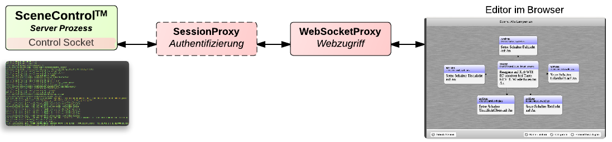


Über einen TCP Port i.d.R. Port 3101 können per JSON kodierte Nachrichten an den Prozess abgesetzt werden.
Der Server selber bietet dabei keine Session- oder Sicherheitsverwaltung.
Diese Funktionalitäten können mit zusätzlichen Proxy Prozessen abgedeckt werden.

### SessionProxy
Der SessionProxy handelt mit dem SceneServer einen neuen Port für das JSON Kommandointerface aus und öffnet selber
den JSON Kommandointerface Port. Somit werden effektiv alle neuen Verbindungen über den SessionProxy ablaufen.
Alle Verbindungen erfordern ab dann eine Authentifizierung gegenüber den auf dem Betriebssystem vorhandenen Benutzern.
Zugriffsrechte werden durch Gruppenmitgliedschaften des angegeben Benutzers geregelt und müssen in der SessionProxy
Konfiguration gesondert angegeben werden.
Ein Beispiel: Ein Nutzer wählt über die Android App eine Szene zur Ausführung aus.
Der SessionProxy wird diese Ausführungsanfrage nur an den SceneServer weiterleiten, wenn der Nutzer sich als "{NUTZER}"
beim Start der Android App authorisiert hat.

### Websocketsproxy
Über den Websocketsproxy können sich Webclients über das WebSocket Protokoll mit dem SceneServer verbinden
und das JSON Kommandointerface des SceneServers nutzen.
